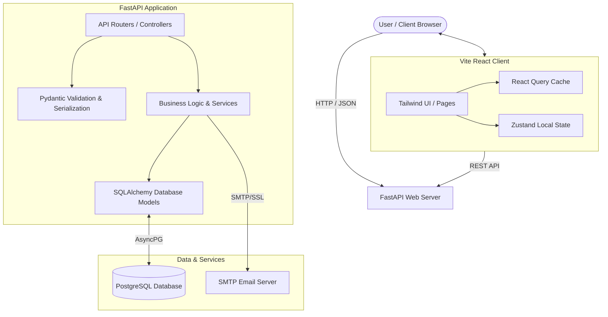
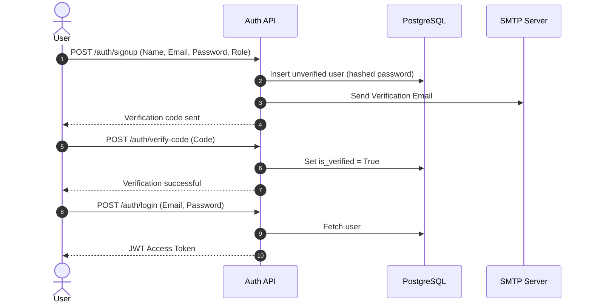
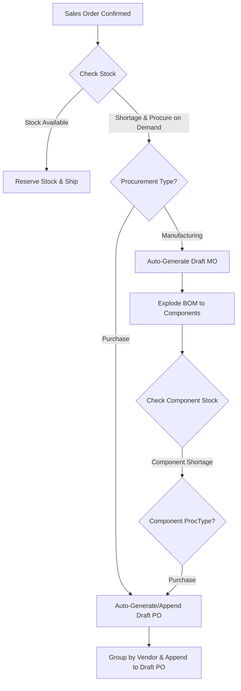
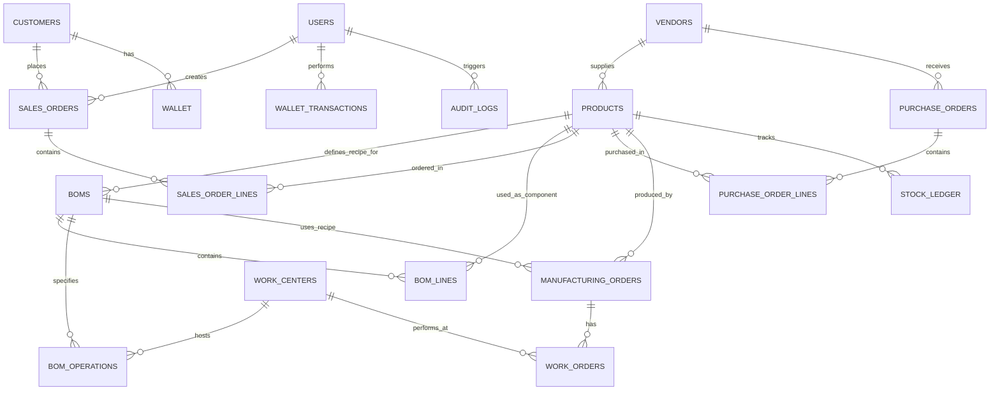

# AutoCrafERP System Architecture

AutoCrafERP is a lightweight, modern Enterprise Resource Planning (ERP) system designed for manufacturing, sales, procurement, and inventory management. The platform is divided into two primary sub-systems: a **FastAPI-based Python Backend** and a **React-based Frontend**.

---

## 1. System Topology & Architecture Overview

The following diagram illustrates the architecture of the AutoCrafERP system:

---

## 2. Core Modules & Flow Diagrams

### A. Authentication & Role-Based Access Control (RBAC)
AutoCrafERP utilizes JSON Web Tokens (JWT) for secure authentication. User privileges are determined using Role-Based Access Control (RBAC) with the following hierarchies:
*   **SuperAdmin**: Full system access, including user management and system configurations.
*   **StoreAdmin**: Access to inventory, recipes (BOMs), and basic configurations.
*   **StockManager**: Access to inventory, receiving POs, and managing stock levels.
*   **Customer**: Read-only access to products, placing orders, and managing their personal wallet.

---

### B. Procurement & Inventory Loop (MTO / MTS)
One of the key strengths of AutoCrafERP is its automated procurement loop. When a Sales Order is confirmed:
1.  **Stock Check**: The system checks if the finished good is available in the inventory.
2.  **Make-to-Order (MTO)**: If the product is configured with `procure_on_demand` and is a `FinishedGood` produced via `Manufacturing`, a **Draft Manufacturing Order** is automatically generated for the shortage quantity.
3.  **Bill of Materials (BOM) Explosion**: The generated Manufacturing Order explodes the recipe into individual component requirements.
4.  **Component Shortages**: The system checks the inventory for each raw component.
5.  **Purchase Reorder**: If a component is short and configured for `Purchase` with `procure_on_demand` enabled, the system automatically creates or appends to a **Draft Purchase Order** for the assigned Vendor.

---

## 3. Database Schema Relation

The database schema, defined via SQLAlchemy and migrated with Alembic, maps the relationships between entities:

---

## 4. Key Architectural Features

### 1. Robust Pydantic Validators
*   **Phone Number Normalization**: Automatically prepends `+91` to 10-digit phone numbers and enforces standard phone formats.
*   **UUID Validation**: Automatically detects and translates legacy frontend identifiers (e.g. `wc1`, `wc2`, `wc3`) into corresponding static UUIDs to prevent validation errors at API boundaries.
*   **Strict Ranges**: Validates that order quantities, prices, and durations are greater than zero to ensure high data integrity.

### 2. Double-Entry Stock Ledger
All inventory movements (Sales Delivery, Purchase Receipt, Manufacturing Consumption, Manufacturing Production, Manual Adjustment) are recorded in the `stock_ledger` table with before-and-after balances to ensure auditability.

### 3. Circular Dependency Guard
When designing or updating Recipes (BOMs), the system performs a recursive depth-first search (DFS) traversal to detect and block circular dependencies (e.g., Product A requires Product B, which requires Product A), preventing infinite loops in automated procurement.

### 4. Transactional Integrity
All order confirmations, stock reservations, and completions execute within atomic database transactions. If any step fails (e.g., insufficient component stock), the entire operation rolls back safely.
